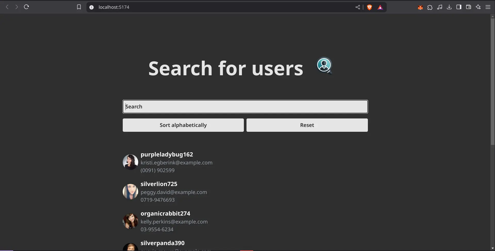

# User Search Application

A practice React application for searching and managing users with filtering, sorting, and search capabilities. This project serves as a learning tool to demonstrate React, TypeScript, and API integration concepts.



## About

This application fetches user data from the public [Random User API](https://randomuser.me/api/), allowing users to:
- Search for users by username
- Filter results in real-time
- Sort users alphabetically
- View user details including profile picture, username, email, and phone number

## Features

- Real-time user search
- Username filtering
- Alphabetical sorting
- Responsive design
- Loading states
- Reset functionality

## Installation

1. Clone the repository:
```bash
git clone https://github.com/DavidLC578/user-search-app.git 
cd user-search-app
```

2. Install dependencies:
```bash
npm install
# or
yarn install
```

3. Start the development server:
```bash
npm run dev
# or
yarn dev
```

The application will be available at `http://localhost:5173`

## Usage

1. Search for users:
   - Enter a username in the search bar
   - Results update in real-time as you type

2. Sort users:
   - Click the "Sort alphabetically" button to sort users by username
   - Sorting is case-insensitive

3. Reset search:
   - Click the "Reset" button to clear the search and show all users
   - The input field will be cleared automatically

4. View user details:
   - Each user card displays:
     - Profile picture
     - Username
     - Email
     - Phone number

## Technologies Used

- React
- TypeScript
- Vite
- Tailwind CSS

## Project Structure

```
src/
├── pages/         # Main application pages
├── services/      # API services
├── interfaces/    # TypeScript interfaces
```

## Contributing

1. Fork the repository
2. Create your feature branch
3. Commit your changes
4. Push to the branch
5. Create a new Pull Request

## License

This project is licensed under the MIT License - see the LICENSE file for details.
